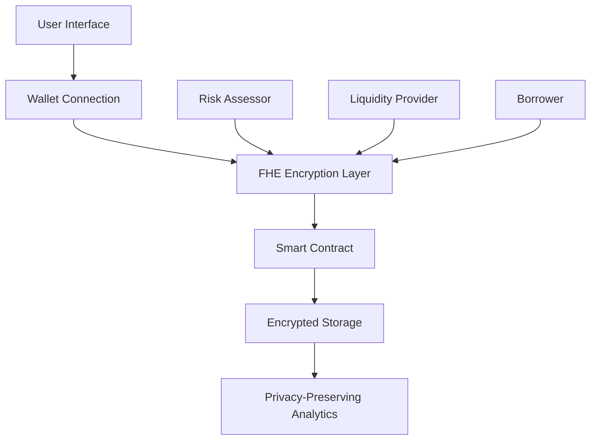

# 🔐 CipherLend - The Future of Private DeFi

> **Revolutionary lending protocol where your financial privacy meets blockchain transparency**

[](https://vercel.com/new/clone?repository-url=https://github.com/orion-tech-88/cipher-lend-flow)
[](https://opensource.org/licenses/MIT)
[](https://zama.ai)

## 🌟 What Makes CipherLend Revolutionary?

Unlike traditional DeFi protocols that expose your financial data, CipherLend uses **Fully Homomorphic Encryption (FHE)** to protect your privacy while maintaining complete system transparency.

### 🔒 Privacy-First Architecture
- **Encrypted Collateral Ratios**: Your borrowing power remains private
- **Zero-Knowledge Risk Assessment**: Credit scores encrypted on-chain
- **Anonymous Liquidity Provision**: Earn yields without revealing positions
- **Private Transaction History**: Your financial activity stays confidential

### ⚡ Lightning-Fast Performance
- **Sub-second Transactions**: Powered by Zama's FHE technology
- **Real-time Encryption**: Data encrypted at the point of entry
- **Efficient Proof Generation**: Minimal gas costs for FHE operations
- **Scalable Architecture**: Built for mass adoption

## 🚀 Quick Start

### Prerequisites
```bash
Node.js 18+ 
npm or yarn
Git
```

### Installation
```bash
# Clone the repository
git clone https://github.com/orion-tech-88/cipher-lend-flow.git
cd cipher-lend-flow

# Install dependencies
npm install

# Set up environment variables
cp env.example .env.local
# Edit .env.local with your configuration

# Start development server
npm run dev
```

### Environment Setup
```env
# Core Configuration
VITE_CHAIN_ID=11155111
VITE_RPC_URL=https://sepolia.infura.io/v3/YOUR_KEY
VITE_WALLET_CONNECT_PROJECT_ID=YOUR_PROJECT_ID

# FHE Configuration
VITE_FHE_NETWORK_URL=https://devnet.zama.ai
VITE_CONTRACT_ADDRESS=YOUR_DEPLOYED_CONTRACT
```

## 🏗️ Architecture Overview



## 🔧 Core Features

### 🛡️ Encrypted Collateral Management
```solidity
// Your collateral ratio is encrypted but verifiable
function createLoan(
    uint256 poolId,
    externalEuint32 amount,
    externalEuint32 collateralAmount,
    bytes calldata inputProof
) public returns (uint256)
```

### 💧 Privacy-Preserving Liquidity Pools
- **Anonymous Contributions**: Add liquidity without revealing amounts
- **Encrypted Rewards**: Earn yields with complete privacy
- **Transparent Solvency**: System remains verifiable while data stays private

### 📊 Zero-Knowledge Analytics
- **Private Risk Scoring**: Credit assessment without data exposure
- **Encrypted Reputation**: Build trust while maintaining anonymity
- **Confidential Reporting**: Impact metrics without revealing identities

## 🎯 Use Cases

### For Borrowers
- **Private Lending**: Access capital without exposing financial position
- **Confidential Collateral**: Use assets as collateral without revealing ownership
- **Anonymous Credit Building**: Establish reputation while maintaining privacy

### For Lenders
- **Secure Yield Farming**: Earn returns without revealing investment strategies
- **Private Liquidity Provision**: Contribute to pools anonymously
- **Risk-Free Lending**: Lend with encrypted risk assessment

### For Institutions
- **Compliant Privacy**: Meet regulatory requirements while protecting user data
- **Transparent Operations**: Maintain auditability with privacy protection
- **Scalable Infrastructure**: Support millions of users with FHE efficiency

## 🛠️ Technology Stack

| Layer | Technology | Purpose |
|-------|------------|---------|
| **Frontend** | React 18 + TypeScript | Modern UI/UX |
| **Styling** | Tailwind CSS + shadcn/ui | Beautiful, responsive design |
| **Blockchain** | Ethereum Sepolia | Testnet deployment |
| **Encryption** | Zama FHE | Privacy-preserving computations |
| **Wallets** | RainbowKit + Wagmi | Multi-wallet support |
| **Smart Contracts** | Solidity + FHE | Encrypted on-chain logic |

## 📱 Supported Wallets

- 🔗 **Rainbow Wallet** - Beautiful, user-friendly interface
- 🦊 **MetaMask** - Most popular Web3 wallet
- 🔌 **WalletConnect** - Universal wallet connector
- 💼 **Coinbase Wallet** - Institutional-grade security
- 📱 **Mobile Wallets** - Full mobile support

## 🔐 Security & Privacy

### FHE Implementation
- **Zama Integration**: Industry-leading FHE technology
- **Encrypted Computations**: All sensitive operations performed on encrypted data
- **Zero-Knowledge Proofs**: Verify without revealing
- **Audit-Ready**: Transparent system with private data

### Smart Contract Security
- **Battle-Tested Libraries**: Using proven FHE implementations
- **Multi-Sig Governance**: Decentralized control mechanisms
- **Emergency Pauses**: Circuit breakers for critical functions
- **Upgradeable Architecture**: Future-proof design

## 🚀 Deployment

### Vercel (Recommended)
```bash
# Deploy to Vercel
npx vercel --prod

# Configure environment variables in Vercel dashboard
# See DEPLOYMENT.md for detailed instructions
```

### Self-Hosted
```bash
# Build for production
npm run build

# Serve with any static host
npm run preview
```

## 📈 Roadmap

### Phase 1: Foundation ✅
- [x] Core FHE integration
- [x] Basic lending functionality
- [x] Wallet connectivity
- [x] UI/UX implementation

### Phase 2: Enhancement 🚧
- [ ] Advanced risk assessment
- [ ] Cross-chain support
- [ ] Mobile app
- [ ] Institutional features

### Phase 3: Scale 🌟
- [ ] Mainnet deployment
- [ ] Governance token
- [ ] Advanced analytics
- [ ] Enterprise solutions

## 🤝 Contributing

We welcome contributions! Please see our [Contributing Guide](CONTRIBUTING.md) for details.

### Development Setup
```bash
# Fork the repository
git clone https://github.com/YOUR_USERNAME/cipher-lend-flow.git

# Create feature branch
git checkout -b feature/amazing-feature

# Make changes and test
npm run dev
npm run test

# Submit pull request
```

## 📄 License

This project is licensed under the MIT License - see the [LICENSE](LICENSE) file for details.

## 🙏 Acknowledgments

- **Zama Team** - For pioneering FHE technology
- **RainbowKit** - For seamless wallet integration
- **shadcn/ui** - For beautiful UI components
- **Ethereum Community** - For the decentralized future

## 📞 Support & Community

- 🐛 **Bug Reports**: [GitHub Issues](https://github.com/orion-tech-88/cipher-lend-flow/issues)
- 💬 **Discussions**: [GitHub Discussions](https://github.com/orion-tech-88/cipher-lend-flow/discussions)
- 📧 **Email**: support@cipherlend.com
- 🐦 **Twitter**: [@CipherLend](https://twitter.com/cipherlend)

---

<div align="center">

**Built with ❤️ for a more private and secure DeFi future**

[Website](https://cipherlend.com) • [Documentation](https://docs.cipherlend.com) • [Demo](https://demo.cipherlend.com)

</div>